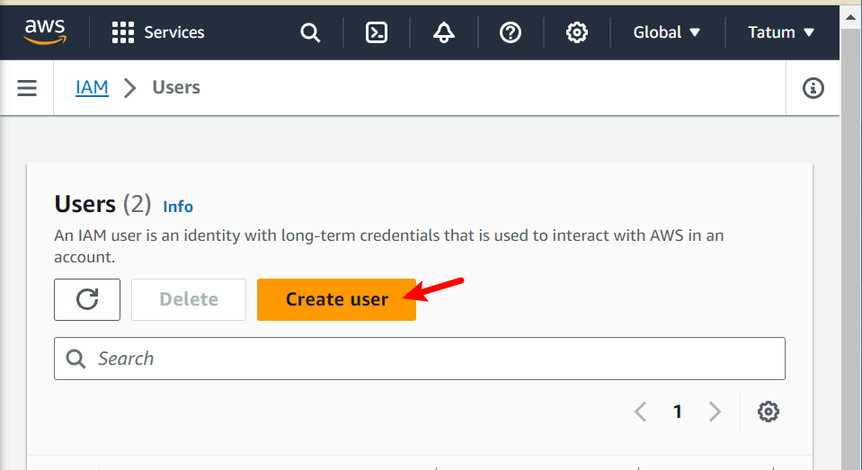

# Terraform Beginner Bootcamp 2023

## Table of content
- [Semantic Versioning](#semantic-versioning-magecloud)
- [Install Terraform CLI](#install-terraform-cli)
  - []()
- []()
- []()
- []()
## Semantic versioning :mage:,:cloud:
THIS PROJECT IS GOING TO EMPLOY SEMANTIC VERSIONING 
[semver.org](https://semver.org/)

Given a version number **MAJOR.MINOR.PATCH ** eg . `1.0.0`, increment the:

* MAJOR version when you make incompatible API changes
* MINOR version when you add functionality in a backward compatible manner
* PATCH version when you make backward compatible bug fixes

Additional labels for pre-release and build metadata are available as extensions to the MAJOR.MINOR.PATCH format.

## Install Terraform cli
### Terraform cli changes
The terraform cli installations instructions have changed due to the gpg keyring changes so we needed to refer to the latest installation instructions and change the terraform scripting for the install
[install terraform cli](https://developer.hashicorp.com/terraform/tutorials/aws-get-started/install-cli#install-terraform)

### Thoughts for linux distributions 
check for the linux distribution to identify any code change according to your distribution needs 
[how to check for linux distribution ](https://www.ionos.com/digitalguide/server/know-how/how-to-check-your-linux-version/)

```
cat /etc/os-release
```

### Restructuring the Bash scripts 
while fixing the installation issues ,the newer codes is a considerable about of code so we decided to use a bash script to install the terraform cli
The bash script:[./bin/install_terraform_cli](./bin/install_terraform_cli)

- The [gitpod.yml](.gitpod.yml) is tidy
- For easier debug sessions and manuel installation of terraform cli 
- this will make it more portable 
### shebang
* shebang tells the bashscript what program that will interpret the script eq `#!/bin/bash`
we used the `#!/usr/bin/env bash` recommended by
chatgpt for portability for diffirent os distribution
[Shebang](https://en.wikipedia.org/wiki/Shebang_(Unix))

- for portability
- will search the users path for executables 

## Execution Consideration for bash scripts
when executing the bash scripts we can use `./`

eg,`./bin/install_terraform_cli`

if it doesnt work to use the `source ./ `

eg,` source ./bin/install_terraform_cli`

then check the files execute permissions with `ls-la` and run with chmod command to fix it 

```sh
chmod u+x ./bin/install_terraform_cli 
```
[chmod commands](https://en.wikipedia.org/wiki/Chmod)


## GITHUB LIFECYCLE (Before,init,command)
We need need to be careful when using the init cause it wunt restart an existing workspace so we use the `before` instead .

see:
[gitpod lifecycle](https://www.gitpod.io/docs/configure/workspaces/tasks)

### WORKING WITH ENV VARS 
#### Env command
we can list all the env variable with env command 
we can filter specific env vars using grep eg. `env | grep aws`
#### SETTING AND UNSETTING ENV VARS 
in the terminal: 
* we can set using `export hello='world'`
* we can unset using `unset hello`
* we can set an env temporarily when running a command 
```sh
hello='world' ./bin/install_terraform_cli

```
In a bash script:
```sh
#!/usr/bin/env bash 

hello='world'
echo $hello
```
#### printing env vars 
print env variables with echo eg. `echo $hello`

#### scopping of envars
 when you open  new bash terminals it  isnt aware of past terminals ,if you want it present in future terminals set env vars in bash profiles eg. `./bash_profiles`

 you can also persist them into gitpod by storing them in gitpods secret storage.
 ```sh
 gp env hello='world'
 ```
 you can store non-sensitive envars in `.gitpod.yml`

 ### AWS CLI INSTALLATION
AWS cli is installed via a bash script [./bin/install_aws_cli](./bin/install_aws_cli)
[Installing Aws cli](https://docs.aws.amazon.com/cli/latest/userguide/getting-started-install.html)
[SET EN VARS](https://docs.aws.amazon.com/cli/latest/userguide/cli-configure-envvars.html)
we can check if our aws credentials is configured correctly by running the following command:
```sh
aws sts get-caller-identity
```
if it is successful it should look like this :
```json

{
    "UserId": "AIDAZ4FSWF33DQIE26Ehn",
    "Account": "123456789012",
    "Arn": "arn:aws:123456789012:user/Terraform_beginner_bootcamp"
}
```
well need to generate AWS CLI credentials from the IAM user
* search for the iam user on the aws seearch bok and click on it 
* click on users
* click on create users

- write a user name 
- click next 
- click on add user to group 
- create a group and add permissions to the group 
- select the group
- create user 

## Terraform Basics
### Terraform registory
This is where the providers and modules are stored 
[registory.terraform.io](https://registry.terraform.io/providers/hashicorp/random/latest/docs/resources/string)

- **Providers** are responsible for understanding API interactions and exposing resources. it is a plugin that enables interaction with an API. it tells terraform the services it needs to interact with [providers](https://registry.terraform.io/browse/providers)
- **Modules** are self-contained packages of Terraform configurations that are managed as a group. they area way to make large amount of terraform code modular, portable and sharable 
#### Terraform console 
view the list of all terraform commands by typing `terraform`
#### Terraform init 
run the `terraform init` to download the binaries for the providers we qill use in the project 

#### Terraform plan 
This will generate a change set use the --out if you want to save the plan 
#### Terraform apply 
This will run a plan and pass the change set to be executed by terraform .apply yes or no or add the --auto-approve flag to automatically approve an appy eg. `terraform apply --auto-approve`

#### Terraform Destroy
This will destroy resources that where previously created by terraform plan 

use the --auto-approve to skip typing yes 
`terraform destroy --auto-approve`
#### Terraform Lock Files

`.terraform.lock.hcl` contains the locked versioning for the providers or modules that should be used with this project .
the terraform lock file should be commited to your Version Control System VSC eg.Github
#### Terraform state files 
`terraform.tfstate`contains information about the current state of your infrastructure 
the file should not be committed to your vcs.
this file can contain sensitive data.
if you loose this file, you lose knowning the state of your infrastructure.
`.terraform.tfstate.backup`is the previous state file 
#### Terraform Directory
`.terraform directory` contains binaries of terraform providers

### issuses with terraform login on gitpod 
when attempting to run the `terraform login `.it will launch a bash view to generate a token .but i ran into an issue while trying to paste the login onto the console 
- click on yes 
- click on p 
- copy from the console `https://app.terraform.io/app/settings/tokens?source=terraform-login` or go to here to generate the login credentials `https://app.terraform.io/app/settings/tokens`and click on generate api token 
- create a file manually 
```sh
touch /home/gitpod/.terraform.d/credentials.tfrc.json
```
- open the file 
```sh
open /home/gitpod/.terraform.d/credentials.tfrc.json
```
- Provide the code and replace token in file
```
{
    "credentials": {
        "app.terraform.io":{
            "token": "REPLACE-WITH-TERRAFORM-TOKEN"
            }
        }
    }
```
we have automated this workaround with the following bash script[bin/generate_tfrc](bin/generate_tfrc)
#### Terraform alias 

- In order to set an alias for terraform in our ~/.bash_profile  I added below in the bash_profile file 
```
alias tf= "terraform"
```
- To reload the file so that the changes will be effected 
```
source ~/.bash_profile 
```
to make sure that it gets loaded each time i set up my workspace i added a bash script and also referenced it in my gitpod.yml file 
chatgpt gave this template 
```sh
#!/usr/bin/env bash

# Define the alias
alias tf="terraform"

# Choose your profile configuration file (e.g., ~/.bashrc or ~/.bash_profile)
profile_file="~/.bash_profile"

# Check if the file exists and is writable
if [ -f "$profile_file" ] && [ -w "$profile_file" ]; then
  # Append the alias to the profile file
  echo 'alias tf="terraform"' >> "$profile_file"
  echo "Alias 'tf' set to 'terraform' in $profile_file"
else
  echo "Error: Unable to modify $profile_file. Make sure the file exists and is writable. else it already exist "
fi

#source the .bash_profile to make the alias available immediately
source $profile_file
```
